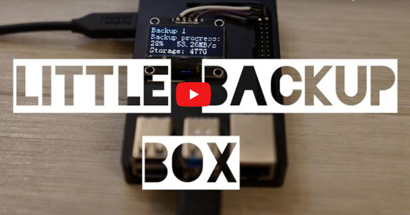
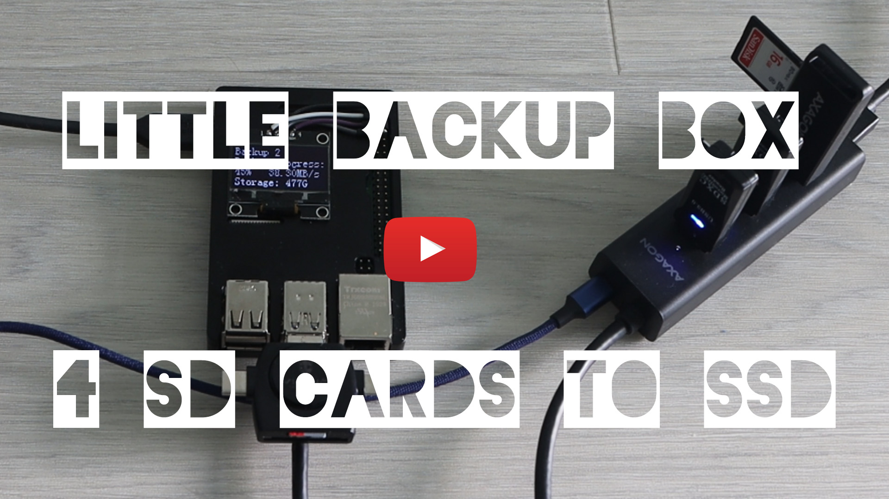
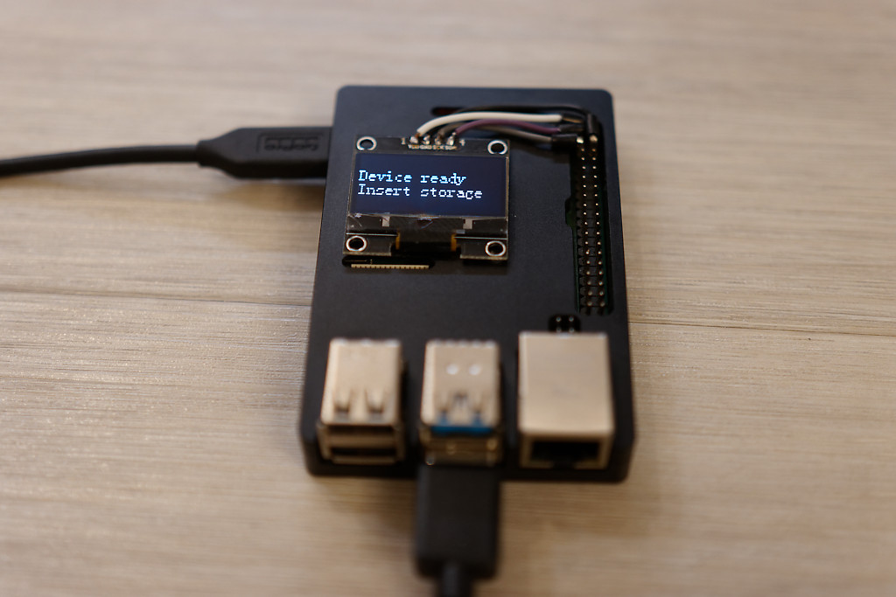
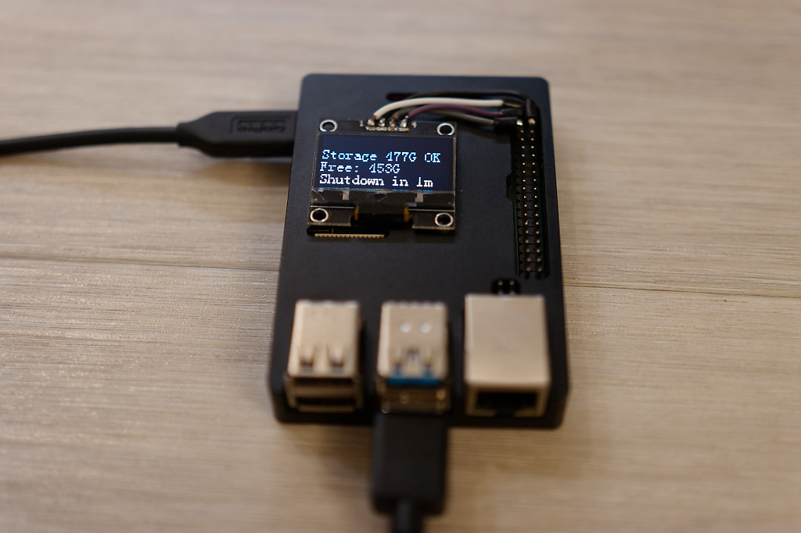
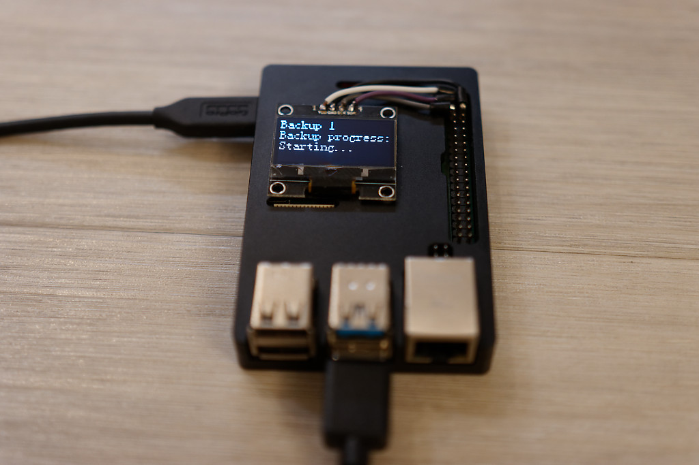
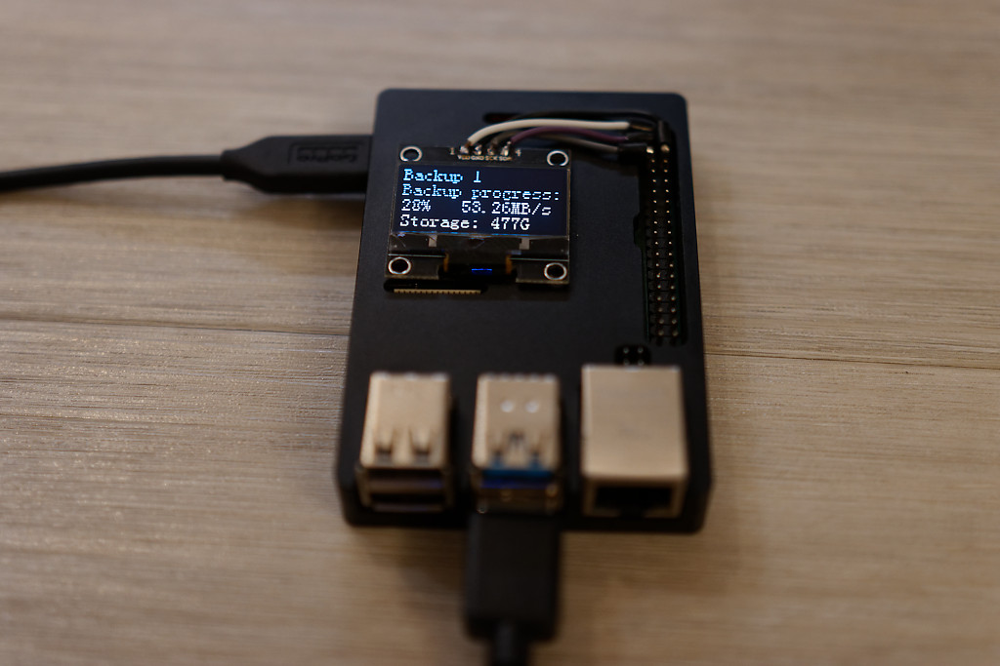
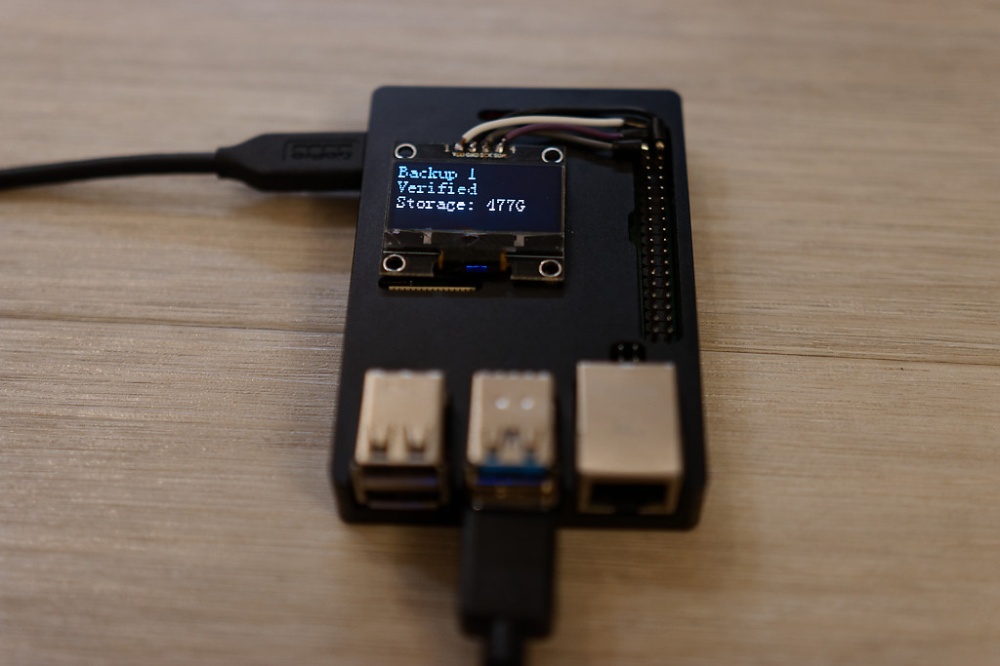
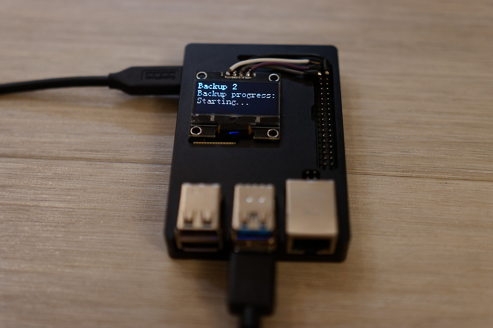
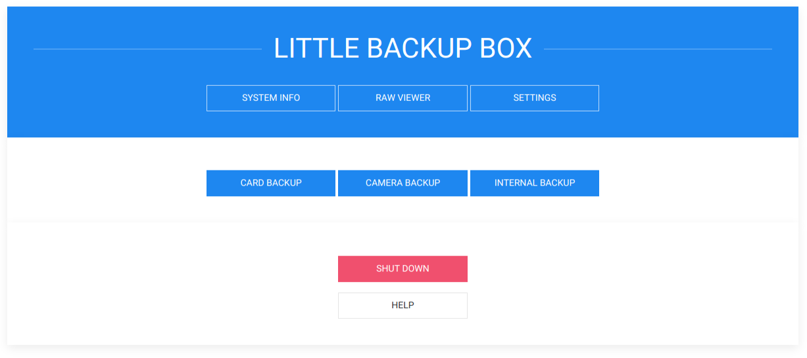

# A fork of Little Backup Box

**Do you need to quickly and safely backup cards, USB sticks, disks and other data storages with a really small, portable and inexpensive device? Then you have found what you are looking for.**

A modified version of the original https://github.com/dmpop/little-backup-box project. With the support for more cards and the details of the progress in an OLED screen. The aim of this fork is to backup more SD cards and provide fine details during the backup. 

The backup is verified and in case of a difference in the source and the target, the backup is displayed as failed.

All mount points for the cards are in config.cfg as
- CARD_MOUNT_POINT="/media/card" # Mount point of the storage card
- CARD_DEV1="sdb1" # Name of the storage card
- CARD_DEV2="sdc1"
- CARD_DEV3="sdd1"
- CARD_DEV4="sde1"

of course, you can add more cards.

## How does it work?

### Backing up a card

### Backing up more cards to an external SSD

- run the device and wait until it is ready, then insert the storage - you can plug in a card in a USB card reader or a powered USB hub with USB HDD or SSD

- once the storage is connected you have one minute to insert a card for backup

- then, the backup is about to start

- you can watch the progress during the backup

- the verification checks that there is no missing file

- you can plug in other cards anytime, during as well as after the backup. If there is something more to backup, the next backup starts

**Tested with OLED Displays:**
- IIC I2C 0.91" 128x32, Driver IC: SSD1306
- 1.3 inch oled IIC Serial White OLED Display Module 128X64 I2C SSD1306 12864 LCD Screen Board VDD GND SCK SDA for Arduino Black

# Little Backup Box

A collection of scripts that transform a Raspberry Pi (or any single-board computer running a Debian-based Linux distribution) into an inexpensive, fully-automatic, pocketable photo backup device.

## Little Backup Box features

- Back up the contents of a storage card to an external USB storage device. Little Backup Box supports practically any USB card reader, and, by extension, any card format.
- Transfer photos and RAW files directly from a camera to an external USB storage device. If your camera is supported by gPhoto2 software, it will work with Little Backup Box.
- Use multiple cards. Little Backup Box assigns a unique ID to each card and create a separate folder for each card on the backup storage device.
- Perform card backup fully automatically with no user interaction.
- Start specific backup operations manually using Little Backup Box's web UI.
- Automatically generate a minimalist responsive gallery from the backed up RAW files.
- Stream the backed up photos to any DLNA-compatible client.
- Access the backed up content from other machines on the network.
- Push backed up contents to a cloud storage service.

## Installation

1. Create a bootable SD card with the latest version of Raspbian Lite for use with Little Backup Box.
2. Make sure that your Raspberry Pi is connected to the internet.
3. Run the following command on the Raspberry Pi: `curl -sSL https://is.gd/nc_lbb | bash`

Little Backup Box supports three backup modes:

- **Card backup** Automatically backs up the contents of a storage card to an external storage device.
- **Camera backup** Transfers photos, RAW files, and videos from the camera connected directly to the Raspberry Pi. The transferred files are saved in the _/home/pi/BACKUP/[CAMERA MODEL]_ directory on the system storage card. **Important** Make sure that the camera is set to the MTP USB connection mode.
- **Internal backup** Automatically backs up the contents of a storage card to the internal storage.

During the installation, choose the desired mode from the selection dialog.

When prompted, reboot the Raspberry Pi.

## Usage

The exact steps depend on the backup mode.

### Remote control mode

The remote control mode is enabled by default. This mode allows you to control and manage Little Backup Box via a web UI. 

1. Point the browser to _http://127.0.0.1:8000_ (replace _127.0.0.1_ with the actual IP address of the Raspberry Pi).
2. Start the desired action by pressing the appropriate button.

- Click the **Speedometer** icon to access basic system information, such as a list of storage devices and memory usage.
- To view JPEG files on the backup storage device, click the  **Image** icon.
- To edit the configuration file, click the **Hamburger** icon.

### Card backup mode

1. Boot the Raspberry Pi
2. Plug in a backup storage device
3. Insert a storage card into a card reader and plug it into the Raspberry Pi. You can connect more cards in unison or separately, during the backup or after it
4. Wait till the end of the whole backup
5. Unplug all the devices
6. Unplug the power cord

**Note:** To differentiate between different storage cards, the backup script creates a datetime-based *.id* file in the root of each storage card. The name of the *.id* file is also used as the destination backup folder on the storage device.

### Camera backup mode

1. Boot the Raspberry Pi
2. Connect the camera to the Raspberry Pi
3. Turn the camera on
4. Wait till the Raspberry Pi shuts down

### Internal backup mode

1. Boot the Raspberry Pi
2. Insert a storage card into a card reader and plug it into the Raspberry Pi
3. Wait till the Raspberry Pi shuts down

## Problems, comments, ideas, updates?

To discuss Little Backup Box-related topics and get the latest updates, visit the [official forum at PIXLS.US](https://discuss.pixls.us/c/hardware/little-backup-box).

Please report bugs and issues in the [Issues](https://github.com/dmpop/little-backup-box/issues) section.

## Uninstall Little Backup Box

To uninstall Little Backup Box, run the following command:

    curl -sSL https://is.gd/nc_ulbb | bash

## Contribute

If you've found a bug or have a suggestion for improvement, open an issue in the [Issues](https://github.com/nickelsound/little-backup-box/issues) section.

To add a new feature or fix issues yourself, follow the following steps.

1. Fork the project's repository repository
2. Create a feature branch using the `git checkout -b new-feature` command
3. Add your new feature or fix bugs and run the `git commit -am 'Add a new feature'` command to commit changes
4. Push changes using the `git push origin new-feature` command
5. Submit a pull request

## Authors

- The multicard extended version - Pavel Lukes
- The original little-backup-box - [Dmitri Popov](https://www.tokyomade.photography/) 

## License

The [GNU General Public License version 3](http://www.gnu.org/licenses/gpl-3.0.en.html)
